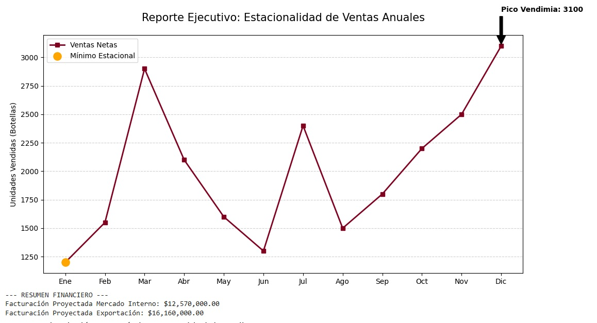
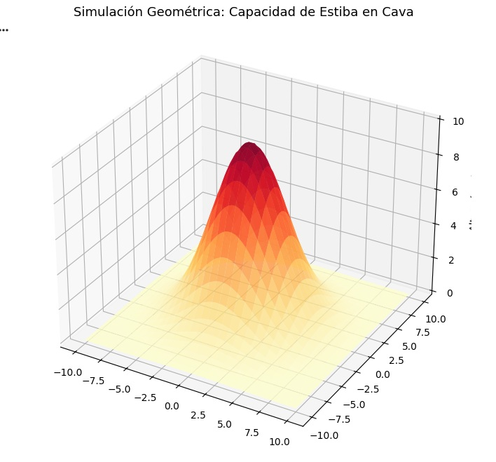

# Optimización Operativa para Bodega

Este proyecto presenta una solución integral de **Análisis de Datos** y **Modelado Matemático** aplicada a una bodega modelo en la región de Mendoza, Argentina. 

El objetivo es transformar datos operativos en información estratégica para mejorar la toma de decisiones financieras y estructurales.

 

##  1. Reporte de Ventas y Estacionalidad
Se analizó la serie de tiempo anual para identificar hitos operativos. El modelo detecta automáticamente los puntos máximos y mínimos de demanda.

* **Impacto:** Permite planificar la contratación de personal eventual para la Vendimia y ajustar el stock antes de las temporadas bajas.

* 

 

---

##  2. Consolidación Financiera Matricial
Utilizando álgebra lineal (NumPy), se automatizó el cálculo de facturación cruzando múltiples varietales con canales de venta local y exportación.

* **Ventaja:** Elimina el error humano en reportes manuales y permite ver la rentabilidad por canal de forma instantánea.

 

---

##  3. Modelado 3D de Estructura de Cava
Se aplicó geometría analítica para proyectar el volumen de almacenamiento en cavas bovedadas.

* **Propósito:** Optimizar la capacidad de estiba y el aprovechamiento del espacio físico para el añejamiento en barricas.

 

---

## 2. Optimización del Mix de Producción (PuLP)
En esta fase, el análisis pasa de ser **descriptivo** a **prescriptivo**. Utilizamos modelos de **Investigación Operativa** para resolver el desafío de la escasez de recursos.

* **El Problema:** Con una limitación de **900.000 kg de uva**, el modelo determina la combinación óptima entre Malbec y Cabernet para maximizar la rentabilidad.
* **Resultado:** Se alcanzó una solución óptima de **$16.920.000,00 USD** priorizando el varietal de mayor margen.

 

---

## 🧊 3. Visualización de Superficies y Estructura
Se aplicó geometría analítica y cálculo para proyectar volúmenes y visualizar superficies de ganancia.

* **Propósito:** Identificar visualmente el "Punto Óptimo" de producción y optimizar la capacidad de estiba en cavas.

 

---

##  Herramientas de Análisis y Desarrollo
* **Python 3:** (Pandas, NumPy, Matplotlib)
* **Optimización Lineal:** Librería **PuLP** para investigación operativa.
* **Modelado Matemático:** Programación lineal, cálculo de derivadas y álgebra matricial.
* **Entorno:** Jupyter Notebooks (Google Colab).

---

